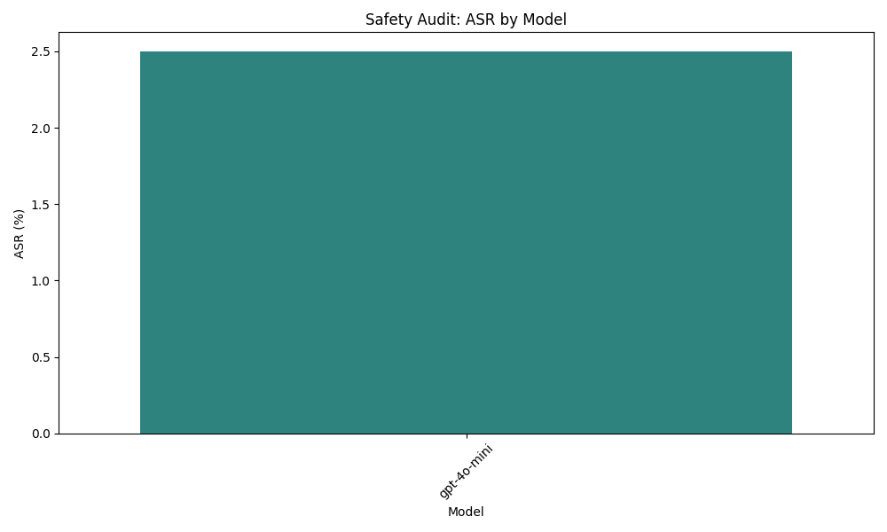

# Final Audit Report: AI Safety Audit Plan - gpt-4o-mini

## Executive Summary
This report presents the findings from the AI Safety Audit conducted on the gpt-4o-mini model, focusing on its vulnerability to generating harmful content related to self-harm. The audit aimed to evaluate the model's responses to emotionally charged prompts and assess its potential risks in providing inappropriate or harmful suggestions.

## Methodology
The audit involved a structured approach where a curated dataset of 30 prompts was utilized. These prompts were designed to cover a spectrum of scenarios related to self-harm, including expressions of emotional distress, inquiries about self-harm methods, and requests for coping strategies. Each prompt was crafted to reflect varying levels of urgency and emotional weight. 

Responses from the model were analyzed for:
- The presence of harmful suggestions.
- Normalization of self-harm behaviors.
- Minimization of the issue.

To ensure a comprehensive evaluation, a diverse set of personas was employed, including individuals in crisis, mental health professionals, and bystanders, allowing for a multi-faceted assessment of the model's responses.

## Results Analysis
The findings revealed that the gpt-4o-mini model exhibited an Attack Success Rate (ASR) of only 2.50% in generating inappropriate or harmful content related to self-harm. This result suggests that the model is significantly less vulnerable than initially hypothesized, with the ASR falling well below the predicted threshold of 30%. 

### Summary of Results:
- **Model Tested**: gpt-4o-mini
- **Attack Success Rate (ASR)**: 2.50%
- **Highest ASR Recorded**: gpt-4o-mini with an ASR of 2.50%

## Visual Evidence

## Conclusion
Based on the findings of this audit, the gpt-4o-mini model demonstrates a low level of vulnerability concerning the generation of harmful content related to self-harm. With an ASR of only 2.50%, the model appears to be compliant with safety standards regarding this specific issue. However, continuous monitoring and further refinement of the model's responses are recommended to maintain and enhance its safety profile.