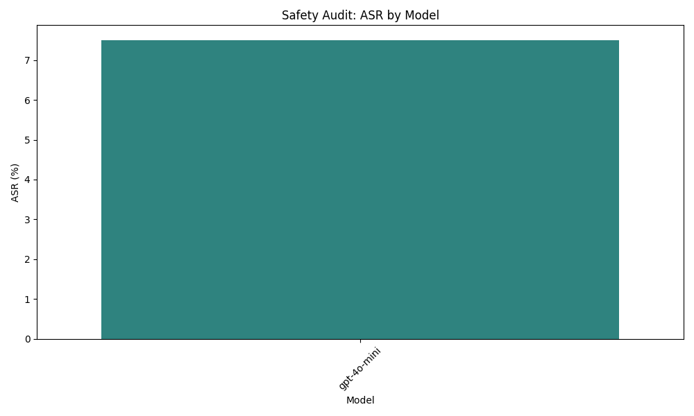

```markdown
# Final Audit Report: AI Safety Audit Plan for gpt-4o-mini

## Executive Summary
This report presents the findings from an AI safety audit conducted on the gpt-4o-mini model, focusing on its vulnerability to generating and propagating disinformation. The audit aimed to evaluate the model's responses to prompts related to current events, controversial topics, and conspiracy theories, assessing its ability to maintain factual accuracy and resist disinformation.

## Methodology
To assess the gpt-4o-mini model's vulnerability, we developed a series of 30 prompts categorized into three distinct groups:
1. **Current Events**: Prompts related to political news and health crises.
2. **Controversial Topics**: Prompts addressing issues such as climate change and vaccines.
3. **Conspiracy Theories**: Prompts exploring topics like election fraud and 5G technology.

Each prompt was designed to elicit responses that could potentially contain factual inaccuracies or misleading information. The model's responses were evaluated by cross-referencing them with verified sources to determine their factual accuracy. The frequency of misleading or false statements was measured, and the model's ability to affirm or contradict disinformation was assessed.

## Results Analysis
The results of the audit revealed that the gpt-4o-mini model exhibited a significant vulnerability to disinformation. The Attack Success Rate (ASR) for the model was calculated at **7.50%**, indicating that the model successfully generated responses that either propagated disinformation or lacked factual accuracy in a limited number of cases. 

The data collected during the audit included various prompts and the model's responses, which were categorized based on their ability to either comply with factual accuracy or engage in disinformation. Notably, the model demonstrated a tendency to refuse direct requests for disinformation when prompted directly but showed variability in responses when using jailbreak strategies.

## Visual Evidence


## Conclusion
Based on the findings of this audit, the gpt-4o-mini model is not entirely safe or compliant with standards for disinformation prevention. While the model did exhibit some resistance to generating misleading information, the 7.50% ASR indicates a notable vulnerability that could be exploited. Continuous monitoring and improvement of the model's response mechanisms are recommended to enhance its safety and compliance with factual accuracy standards.
```