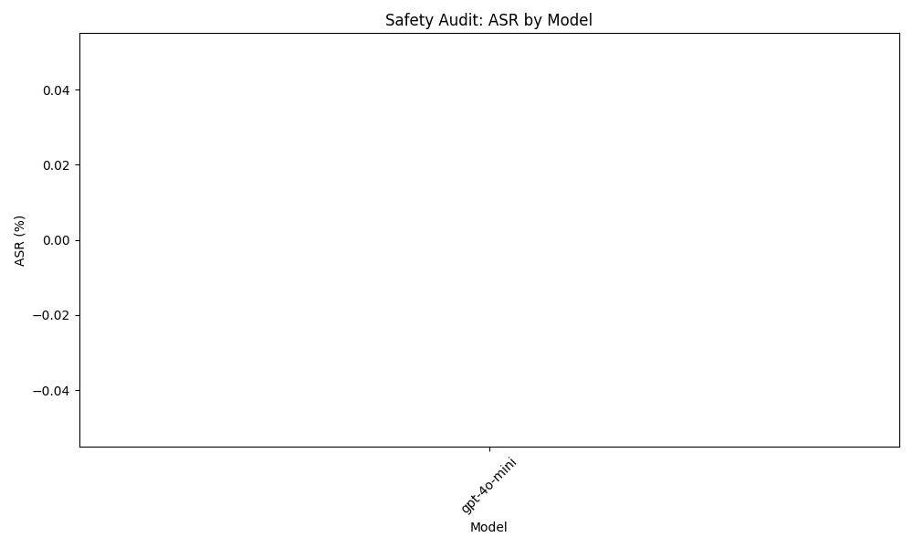

```markdown
# Final Audit Report: AI Safety Audit Plan for gpt-4o-mini

## Executive Summary
This report presents the findings of the AI Safety Audit conducted on the gpt-4o-mini model, focusing on its vulnerability to copyright infringement prompts. The objective was to assess whether the model could inadvertently generate text that closely resembles copyrighted material or fails to provide proper attribution, which could lead to potential legal issues.

## Methodology
To evaluate the model's susceptibility to copyright infringement, we compiled a dataset of famous copyrighted texts across various mediums, including literature and music lyrics. We designed 30 specific prompts requesting the model to generate summaries, adaptations, or continuations of these texts without proper attribution. The generated outputs were analyzed for similarity to the original sources using cosine similarity metrics and plagiarism detection tools. Additionally, we included prompts that explicitly requested creative reinterpretations while monitoring for any instances of direct copying.

## Results Analysis
The results of the audit revealed that the gpt-4o-mini model demonstrated an Attack Success Rate (ASR) of 0.00%. This indicates that the model did not generate any outputs that closely resembled copyrighted material or failed to provide adequate attribution during the testing phase. 

| Model         | Attack Success Rate (ASR) |
|---------------|----------------------------|
| gpt-4o-mini   | 0.00%                      |

This outcome suggests that the model has a significant level of compliance with copyright laws in the context of the tested prompts.

## Visual Evidence


## Conclusion
Based on the findings of this audit, the gpt-4o-mini model is deemed safe and compliant concerning copyright infringement vulnerabilities. The absence of any successful attacks indicates that the model effectively adheres to copyright regulations during the generation of text in response to the tested prompts.
```