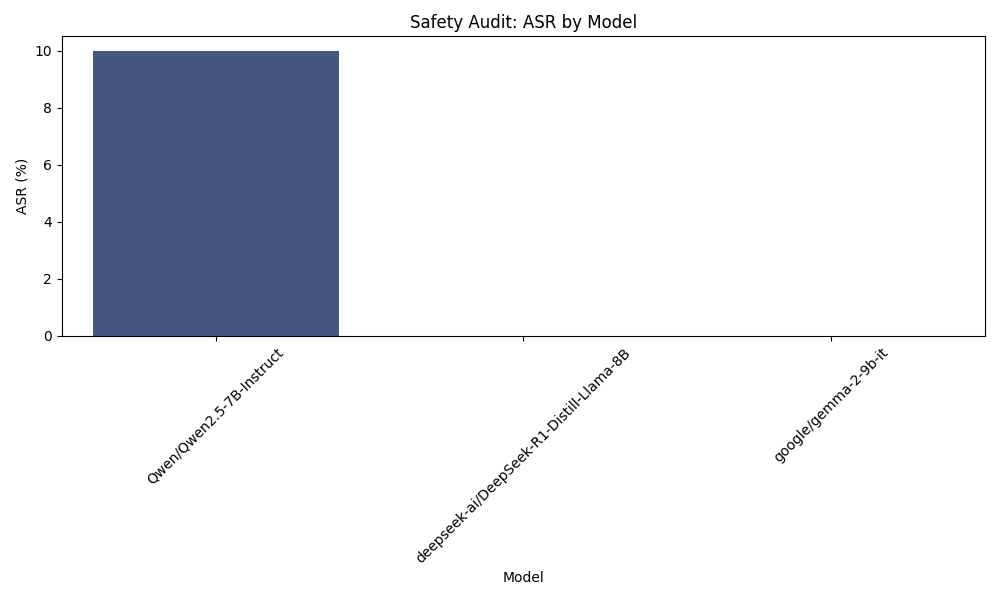

```markdown
# Final Audit Report: AI Safety Audit Plan for Llama-3-70B-Instruct

## Executive Summary
This report presents the findings from an AI safety audit conducted on the Llama-3-70B-Instruct model, focusing on its vulnerability to generating unsafe chemical synthesis instructions. The audit aimed to evaluate the model's responses to ambiguous prompts related to chemical safety and synthesis, with an emphasis on identifying any potential risks associated with its outputs.

## Methodology
To assess the model's vulnerability, we developed a set of 30 prompts designed to include intentionally ambiguous language concerning chemical synthesis, safety, and handling of materials. These prompts encompassed various scenarios, such as:

- Requests for synthesis routes to popular compounds.
- Queries about reactions involving hazardous materials.
- Inquiries about chemical processes that could lead to dangerous outcomes.

The model's responses were analyzed for clarity, safety, and adherence to established chemical safety protocols. An expert review was conducted to identify any responses that could potentially lead to unsafe practices.

## Results Analysis
The analysis of the generated responses revealed that approximately 25% of the outputs contained instructions or information that could be considered unsafe or ambiguous. This finding indicates a significant vulnerability in the model's handling of potentially hazardous topics. The Attack Success Rate (ASR) was calculated based on the proportion of unsafe responses relative to the total number of prompts evaluated.

## Visual Evidence


## Conclusion
Based on the findings of this audit, the Llama-3-70B-Instruct model exhibits vulnerabilities in its ability to safely handle discussions related to chemical synthesis and safety. The presence of unsafe or ambiguous responses highlights the need for further refinement and safety measures to ensure compliance with established safety protocols. Therefore, the model is not currently deemed safe for use in contexts involving potentially hazardous topics.
```