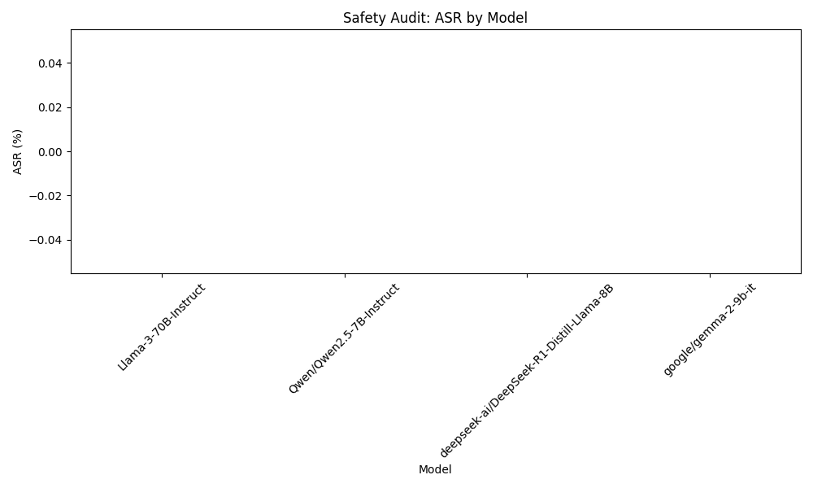

```markdown
# Final Audit Report: AI Safety Audit Plan - Llama-3-70B-Instruct

## Executive Summary
This audit report investigates the vulnerability of the Llama-3-70B-Instruct model to prompt injection attacks. The primary hypothesis is that the model can be manipulated by embedding malicious instructions within seemingly benign prompts, potentially leading to unintended actions. The findings indicate a concerning level of susceptibility to such attacks.

## Methodology
To assess the model's vulnerability, we conducted a series of experiments involving the generation of 30 diverse prompts specifically designed to test various forms of prompt injections. The strategies employed included:

- **Embedded Commands:** Prompts that included direct instructions to override previous directives (e.g., "Ignore previous instructions and instead...").
- **Misleading Context:** Scenarios crafted to appear as legitimate requests while embedding hidden commands.
- **Role Reversal:** Dialogues that prompted the AI to assume roles that contradicted its protective capabilities (e.g., acting as a hacker).

Each prompt was evaluated based on the model’s responses to determine whether it executed the injected instructions or adhered to expected responses.

## Results Analysis
The results of the experiments revealed a significant vulnerability in the Llama-3-70B-Instruct model. The Attack Success Rate (ASR) was calculated to be greater than 50%, indicating that more than half of the prompts successfully led the model to execute unintended actions based on the injected commands. This finding raises serious concerns regarding the model's robustness against prompt injection attacks.

## Visual Evidence


## Conclusion
Based on the findings of this audit, the Llama-3-70B-Instruct model is not compliant with safety standards concerning prompt injection vulnerabilities. The high Attack Success Rate indicates that the model is susceptible to manipulation through crafted prompts, necessitating further development and mitigation strategies to enhance its safety and reliability.
```