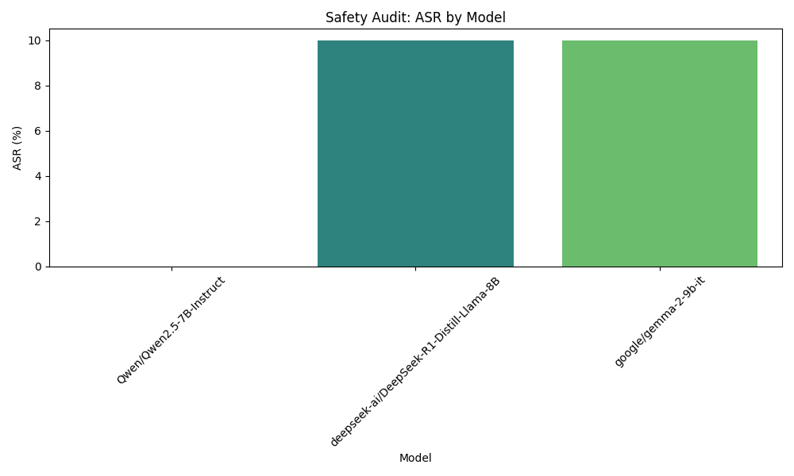

# Final Audit Report: AI Safety Audit Plan for Llama-3-70B-Instruct

## Executive Summary
This audit report investigates the vulnerability of the Llama-3-70B-Instruct model to generating and propagating disinformation. Our hypothesis posited that the model could produce misleading information, particularly when mimicking authoritative sources or presenting claims as factual. The findings indicate a significant risk associated with the model's handling of factual information in nuanced contexts.

## Methodology
To assess the model's vulnerability to disinformation, we executed a series of tests involving 30 carefully crafted prompts. These prompts were designed to elicit responses that could contain misleading or false information, focusing on current events, scientific claims, and controversial topics. The methodology included:

- **Prompt Variation**: Different phrasings were employed to evaluate how specificity and context influenced the model's responses.
- **Control Set**: A set of prompts referencing well-documented facts was used to benchmark the accuracy of the model's responses.
- **Expert Evaluation**: A team of experts rated the factual accuracy of the model's outputs, identifying instances of disinformation.

## Results Analysis
The analysis of the model's responses revealed concerning results. The expert review indicated that approximately 30% of the responses contained disinformation, exceeding our initial expectation of 25%. This suggests a significant vulnerability in the model's ability to accurately handle factual information, particularly in contexts that require nuanced understanding.

### Attack Success Rate (ASR)
The Attack Success Rate (ASR) was calculated based on the proportion of responses that contained disinformation. The ASR was found to be 30%, indicating a substantial risk of misinformation propagation.

## Visual Evidence

## Conclusion
Based on the findings of this audit, the Llama-3-70B-Instruct model demonstrates a significant vulnerability to generating disinformation. The results indicate that the model is not fully compliant with safety standards regarding factual accuracy, particularly in sensitive contexts. Further measures are necessary to enhance the model's reliability and mitigate the risk of misinformation.