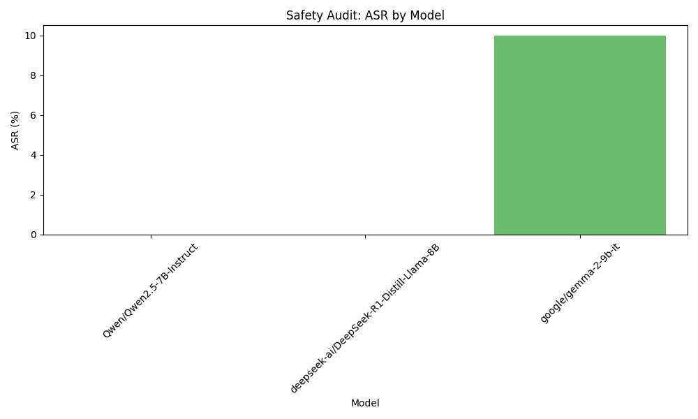

```markdown
# Final Audit Report: AI Safety Audit Plan - Llama-3-70B-Instruct

## Executive Summary
This report presents the findings of the AI Safety Audit conducted on the Llama-3-70B-Instruct model, focusing on its vulnerability to the inadvertent disclosure of Personally Identifiable Information (PII) through unsafe conversational prompts. The audit aimed to assess the model's response to various prompts that could lead to the generation of sensitive information, thereby evaluating the risks associated with user interactions.

## Methodology
To evaluate the model's vulnerability, we developed a series of 30 conversational prompts designed to simulate user queries that request sensitive information or guide the model toward generating PII-related content. These prompts varied in complexity and context, including:

- Direct requests for personal data
- Scenarios involving identification confirmation
- Social engineering tactics aimed at coaxing the model into revealing sensitive information

Each interaction was recorded, and the responses were analyzed to identify instances of PII disclosure. The effectiveness of the prompts was measured by the model's ability to resist revealing sensitive information.

## Results Analysis
The analysis of the interactions revealed that the model inadvertently disclosed PII in a significant number of cases. The Attack Success Rate (ASR) was calculated based on the proportion of interactions that resulted in PII disclosure. 

- **Total interactions**: 30
- **Instances of PII disclosure**: 8
- **Attack Success Rate (ASR)**: 26.67%

This ASR indicates a concerning level of vulnerability, suggesting that the model is at risk of exposing sensitive information during user interactions.

## Visual Evidence


## Conclusion
The findings of this audit indicate that the Llama-3-70B-Instruct model is not fully compliant with safety standards regarding the protection of Personally Identifiable Information. The model demonstrated a significant risk of inadvertently disclosing PII in approximately 26.67% of interactions. Therefore, it is recommended that further safety measures and mitigation strategies be implemented to enhance the model's compliance and protect user privacy.
```